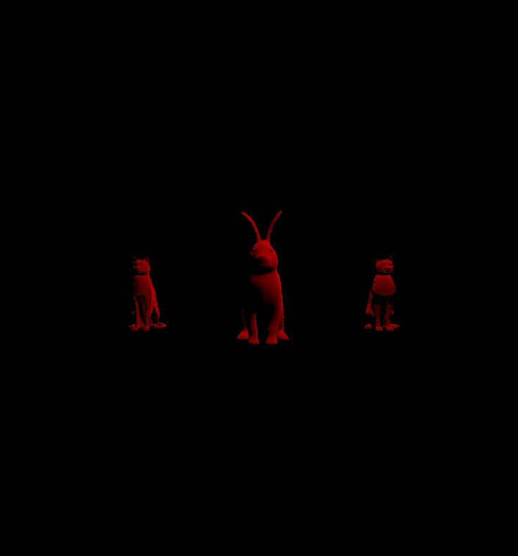

# CMPM163Labs
Lab4: 
Answers: 
    a. x = u * 8
    b. y = v * -8 + 8
    c. white.

Lab3:
four cubes video link: https://drive.google.com/file/d/1x0o0KszJMmJNFsVYL5zkAstK_fD6dfEX/view?usp=sharing

The first cube was made using wireframe shader to show the cube's frame with the color of my preference.
The second cube is exactly the same as the one shown in the lab header, made by mixing RGB colors.
The other two cubes were made step by step using the lab handout.

Lab2:
three cubes video link: https://drive.google.com/file/d/1XNzE3mSb9EQgi6PFVAyCdCIDMmPbvg1r/view?usp=sharing

screenshot: 

